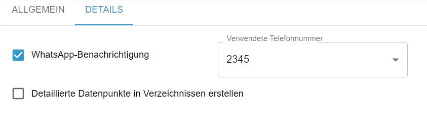

# ioBroker.abfallkalender

## Abfallkalender für den ioBroker

Der Adapter liest die Müllabfuhrtermine des Anbieters abfall.io aus, den verschiedene Städte nutzen. Die einzelnen Müllarten der Stadt können ausgewählt und z.B. in einem Kalender dargestellt werden. 

Wenn der [Whatsapp Adapter]( https://github.com/ioBroker/ioBroker.whatsapp-cmb) im ioBroker installiert ist, wird das automatische Versenden von Nachrichten vor der Abholung pro Abfallart unterstützt. Die Anzahl der Tage zum Versand der Nachricht vor der Abholung, kann  individuell für jede Abfallart eingestellt werden.

Der Adapter beinhaltet zwei Widgets für die [VIS 2 (!)](https://www.npmjs.com/package/iobroker.vis-2-beta?activeTab=readme). Es kann ein Kalender mit den konfigurierten Müllarten oder ein Icon mit verschiedenen Konfigurationsmöglichkeiten dargestellt werden. Das Icon kann x Tage vor der Abholung anfangen zu blinken, wenn das in den Adaptereinstellungen zur Abfallart konfiguriert ist 

 Sind [VIS](https://github.com/ioBroker/ioBroker.vis) oder [VIS 2 (!)](https://www.npmjs.com/package/iobroker.vis-2-beta?activeTab=readme) UND das Widget-Set [inventwo](https://github.com/inventwo/ioBroker.vis-inventwo) installiert, wird ein Datenpunkt erzeugt, der den Widget-Code für eine JSON-Tabelle beinhaltet.

**_Allgemeine Adaptereinstellungen:_**

**_Detaileinstellungen:_**

**_Beispiele Widgets:_** 

- *Kalender*

- *Icon (Mülltonne)*

- *Icon (Gelber Sack)*

- *Icon (Blatt)*

## Changelog

<!--
	Placeholder for the next version (at the beginning of the line):
	### **WORK IN PROGRESS**
-->
### 1.0.0-alpha.0 (2023-03-20)

-   (Formifan2002) initial release

### Sentry
This adapter uses Sentry libraries to automatically report exceptions and code errors to the developers. For more details and for information how to disable the error reporting see [Sentry-Plugin Documentation](https://github.com/ioBroker/plugin-sentry#plugin-sentry). Sentry reporting is used starting with js-controller 3.0.

## License

MIT License

Copyright (c) 2023 Formifan2002 <formifan2002@web.de>

Permission is hereby granted, free of charge, to any person obtaining a copy
of this software and associated documentation files (the "Software"), to deal
in the Software without restriction, including without limitation the rights
to use, copy, modify, merge, publish, distribute, sublicense, and/or sell
copies of the Software, and to permit persons to whom the Software is
furnished to do so, subject to the following conditions:

The above copyright notice and this permission notice shall be included in all
copies or substantial portions of the Software.

THE SOFTWARE IS PROVIDED "AS IS", WITHOUT WARRANTY OF ANY KIND, EXPRESS OR
IMPLIED, INCLUDING BUT NOT LIMITED TO THE WARRANTIES OF MERCHANTABILITY,
FITNESS FOR A PARTICULAR PURPOSE AND NONINFRINGEMENT. IN NO EVENT SHALL THE
AUTHORS OR COPYRIGHT HOLDERS BE LIABLE FOR ANY CLAIM, DAMAGES OR OTHER
LIABILITY, WHETHER IN AN ACTION OF CONTRACT, TORT OR OTHERWISE, ARISING FROM,
OUT OF OR IN CONNECTION WITH THE SOFTWARE OR THE USE OR OTHER DEALINGS IN THE
SOFTWARE.
